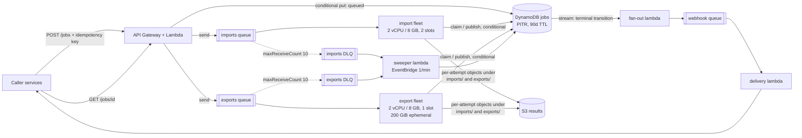

# Design review: legacy file conversion service

**Verdict: keep the proposal's shape, change three things about it.** These services suit 1,000 jobs/day of long, single-threaded, memory-hungry work. The problem is that one queue, one fleet, one task size, and one timeout serve two workloads whose runtimes differ by two orders of magnitude, and that the worker treats at-least-once delivery as exactly-once.

## 1. Risk ranking

**1. The worker fails healthy jobs, and strands others in `running`.** A 30-second deadline times out every real job, and the timeout path calls `retry()` without `kill()`, leaving an orphan on ~2 GB while the redelivery converts beside it: the exit-137 spiral. Three deliveries later `receiveCount >= 3` fails it. At that deadline the success rate on real work is approximately zero — this is not the more frequent bug, it is the difference between a service and no service. *Customer impact:* valid work fails indistinguishably from a bad file, and a worker that dies mid-message leaves the caller polling forever.

**2. Two workers can own one job, and the slower one's write wins.** Deliveries 100 ms apart both read `queued` and both convert; every `put` is an unconditional whole-item write over a stale snapshot, so whichever finishes *last* publishes last, over the same `result.json`. *Customer impact:* a superseded or half-written package reaches the customer, and the duplicate export wastes a contended slot for 30 minutes.

**3. One queue, one fleet, ten concurrent messages on a 1 vCPU / 4 GB task.** Ten ~2 GB conversions against 4 GB is fivefold oversubscription — the OOM killer behind exit 137 — and ten single-threaded jobs on one core run at a tenth speed each, feeding risk 1. One queue also puts a five-second import behind 40-minute exports, and 40 GB does not fit the default 20 GiB disk. *Customer impact:* imports that take seconds take hours; exports die on disk-full or OOM.

**Left alone — DynamoDB, API Gateway, and Lambda as the control plane.** Get-by-id, one conditional write per transition, a 90-day TTL; that write is also the primitive risk 2 needs. *Revisit when* callers need queries the key schema cannot serve, write rejections pass ~1% sustained, or cold starts dominate p99.

**Left alone — one worker codebase and image for both converters.** I split the queues, fleets, and sizing, not the code; the price is an image carrying a JVM imports never use. *Revisit when* task start exceeds ~10% of import p50, or either path's CVE schedule forces redeploys of the other.

## 2. Smallest set of changes before v1

1. **Split the queue and the fleet**, each with its own DLQ and scaling policy, and set `maxReceiveCount` to 10, not 3: deferrals spend a receive without spending an attempt, so a redrive threshold equal to the attempt budget quietly halves it. The queue's counter is a backstop; stored `attempt` is the budget.
2. **Size for the conversion:** `slots = min(vCPU, floor((memGiB − 2)/2), floor(0.8 × diskGiB / scratchGiB))` — 2 slots per import task, 1 per export task with its 200 GiB.
3. **Per-kind deadlines** (15 and 120 minutes), terminating *and reaping* on expiry. *(Implemented.)*
4. **Visibility timeout ≥ deadline + grace, heartbeated**, with `ChangeMessageVisibility(0)` on a released retry, which otherwise waits out 125 minutes. *(Implemented.)*
5. **Single-writer discipline:** a `version` attribute and conditional *partial* updates — a whole-item write destroys the idempotency key and the TTL attribute — conditioned on `attribute_not_exists(version) OR version = :expected`, so existing rows stay claimable. *(Implemented.)*
6. **Per-attempt keys under a per-kind prefix**, making the record write the one atomic publish point. *(Implemented.)*
7. **Classification:** exit 2 fails immediately; 137 and deadlines retry against stored `attempt`; a failure with no exit code gets one retry and its own counter, since it usually means the wrapper broke. *(Implemented.)*
8. **A sweeper Lambda every minute**, failing leases expired beyond any possible in-flight message and draining DLQs into `failed`. This is what guarantees a terminal state.
9. **Scale-in protection while converting** (`stopTimeout` caps at 120 s), which also means export deploys wait for in-flight work: budget two hours.
10. **S3 lifecycle: expire `exports/` at 14 days, keep `imports/` 90, abort incomplete multipart uploads at 7.** See §5.

Not in v1: splitting repos, an orchestrator, multi-region, or replacing SQS.

## 3. Job lifecycle

**Import.** `POST /jobs` → the API Lambda creates the job with a conditional write on an item keyed by the idempotency key, not a GSI lookup, since index reads are never strongly consistent and two concurrent submissions would both miss and create two jobs. The API owns `queued`; the message carries only `{jobId}`. A worker reads with `ConsistentRead` — a stale read loses the claim — then claims the job with a conditional update to `running`, `attempt = n+1`, and a lease; the loser returns its message. It converts under a 15-minute deadline, writes `imports/{id}/attempts/{n}/result.json`, then conditionally writes `succeeded` pointing at it — **object first, record second**.

**Export.** Same flow, different economics: one slot, 200 GiB of scratch, a 120-minute deadline, the vendor JVM as a subprocess whose exit code the wrapper surfaces, and a multipart upload of 10–40 GB. Its visibility timeout is 125 minutes, heartbeated, and the task is scale-in protected; if it dies anyway, the lease expires and attempt `n+1` restarts from scratch.

**Retry boundaries.** Exactly one: the queue. A retry sharing the memory and disk that just failed is the least likely to succeed and the most likely to OOM its neighbours. Stored `attempt` is the budget (3), the redrive policy sits above it, permanent failures short-circuit it, and the DLQ is terminal.

**How the caller learns.** `GET /jobs/{id}` reads the item; the four external states are its `status`. Webhooks derive from the committed transition: a stream filtered to terminal states invokes a Lambda that only fans the event into a delivery queue. Delivering on the shard would let one customer's failing endpoint block everyone else for the stream's 24-hour retention — a cross-customer outage introduced by a reliability change. Retries are bounded, the on-failure destination is S3 (the only one carrying the payload), and callers dedupe on `(jobId, status)`.

## 4. Operations, deployment, observability

Everything above lives in one CDK app in this repo — every queue, table, task definition, Lambda, and alarm — so a threshold is reviewed in the same pull request as the code that trips it. Telemetry is CloudWatch EMF on stdout, where `kind` and `classification` are the only *dimensions*, since each unique dimension set is a separately billed custom metric; `jobId`, `attempt`, and image tag are properties, free and still queryable. Log groups get explicit retention and the JVM's stdout is captured as a tail, not a stream.

| Signal | Metric and emission point | Threshold | Action |
|---|---|---|---|
| Backlog is not draining | `ApproximateAgeOfOldestMessage`, per queue, from SQS | imports > 10 min for 5 min; exports > 60 min for 10 min | Page. Compare desired vs running tasks: stuck scaling is almost always the Fargate vCPU quota or subnet IP exhaustion, fixed by a limit increase, not code. If tasks are running and age still climbs, look for one job cycling through retries. |
| Failures that are ours, not the customer's | `job.failed` by `classification` and `kind`, EMF from the handler's terminal write | `classification=transient` > 5% of terminal jobs over 15 min | Page. Permanent failures (a customer's broken `.mdb`) are deliberately excluded and get a weekly report instead. Split by image tag in Logs Insights against the last deploy, roll back if correlated, otherwise sample the DLQ. |
| Paying to do the same work twice | `job.deadline_exceeded`, `job.lease_held`, `job.claim_conflict`, `job.stale_write_discarded`, `job.unclassified_failure`, EMF from the handler | any `deadline_exceeded` above ~1/hour per kind, or conflicts above 10/hour | Ticket, not a page. Early warning for the risk-1 and risk-2 spirals: a deadline that no longer matches p99 runtime, a heartbeat that stopped extending visibility, or a wrapper that stopped reporting exit codes. Ignored, they become OOM kills and duplicate exports. |
| The bill is 90% one line | `BucketSizeBytes` per prefix, daily, from S3 | export prefix above ~70 TB, or import prefix growing after day 90 | Ticket. A lifecycle rule that silently stops matching — a key layout change, a mistyped prefix — is invisible in every other signal, and it is the difference between a $2,600 and a $9,600 month. |
| Nothing reaches a dead end unnoticed | DLQ depth per queue; the sweeper's `Errors` and an `Invocations == 0` dead-man; `IteratorAge` on the webhook stream mapping; the five-minute canary, alarmed with `TreatMissingData: breaching` | any DLQ message; sweeper silent for 5 min; `IteratorAge` > 15 min; one canary miss | Page. These watch the parts that make the guarantees: the DLQ is where unrecoverable jobs land, the sweeper is what makes "every job reaches a terminal state" true, `IteratorAge` is the only warning before the stream's 24-hour retention discards notifications, and a canary alarm left on the default missing-data treatment scores a total submission outage as healthy. |

**How a change reaches production.** GitHub Actions on pull request runs typecheck, the vitest suite, and a `cdk diff` posted as a comment; on merge it builds one image tagged with the commit SHA, scans it, pushes to ECR, and deploys to staging, where the five-minute canary — one small import, one small export — must pass before promotion. Production is a rolling deployment of that same digest, one fleet at a time, imports first because their blast radius is minutes rather than tens of minutes. A bad release surfaces as the canary going red, `job.failed{classification=transient}` breaching, or task starts failing, with deploy markers on the dashboard and the image tag in the logs for the split. Stopping and reversing are different levers: stopping is desired count to zero on the affected fleet, safe because the queue holds the work and costs only latency; reversing is redeploying the previous task definition revision. ECS deployment alarms on that transient-failure metric make rollback automatic — the circuit breaker alone only catches tasks that fail to *start*, and a task that starts cleanly and fails every job never trips it.

**Failure, recovery, ownership.** Every failure mode resolves to the same two mechanisms: the queue redelivers, and the conditional write decides who may publish — appendix D walks the matrix. A dependency outage is therefore a latency event, not a data-loss event, because the queue holds 14 days of backlog (the maximum, set explicitly; the default is four). DR is rebuild-and-replay at RPO ≈ 5 minutes, with the regional prerequisites in appendix E. Platform owns the queues, fleets, and pipeline and pages on these signals; permanent conversion failures route to the converter's owning team.

## 5. Sizing and cost

At us-east-1 on-demand rates an import slot costs **$0.058/hour** and an export slot, with its 200 GiB attached, **$0.137/hour**. Assume import mean 3 minutes, export mean 30 minutes, 20 GB packages.

**Onboarding evening — 2,400 imports + 600 exports.** Import work is 2,400 × 3 min = 120 slot-hours; export work 600 × 30 min = 300 slot-hours. Draining imports in 1 hour and exports in 4 needs 120 import slots (**60 tasks**) and 75 export slots (**75 tasks**): 270 vCPU and ~15 TB of scratch at peak, for ≈ **$48**. Money is not the constraint; the vCPU quota (6 by default, against 270 needed), /22 subnets for 135 ENIs, and a zero-task guard on the scaling metric are — `messagesVisible / runningTasks` divides by zero at zero tasks and never scales out, on the one evening that matters.

**Normal month — 800 imports + 200 exports a day.** Compute is 1,200 import slot-hours ($70) plus 3,000 export slot-hours ($410), ×1.4 for scale-from-zero lag ≈ **$670**. Exports create 120 TB/month and imports ~5 TB, so at 90-day retention S3 holds ~375 TB ≈ **$8,600**; with ~$300 of DynamoDB, SQS, CloudWatch, and VPC endpoints the total is **$9,600/month, 90% of it S3.**

The change that cuts that most is the key layout that makes a lifecycle rule expressible at all: S3 prefixes are literal, so `jobs/*/attempts/*` matches nothing. Keyed as `exports/{id}/…` and `imports/{id}/…`, exports expire at 14 days (56 TB, **$1,290**) while import JSON is kept the full 90 (14.4 TB, **$330**) because exports read it — expiring it breaks future exports rather than merely making a download unavailable. That is ≈ **$2,600/month**, a 73% cut, and it needs two companions (appendix A): aborting incomplete multipart uploads, which retried 10–40 GB uploads leave billed, and the S3 gateway endpoint, since 240 TB/month each way through NAT is ~$13,000.

---

*[APPENDIX.md](./APPENDIX.md): cost table and rates, slot-formula derivation, quota and ENI planning, the failure and DR walkthrough, and the secondary dashboard.*
