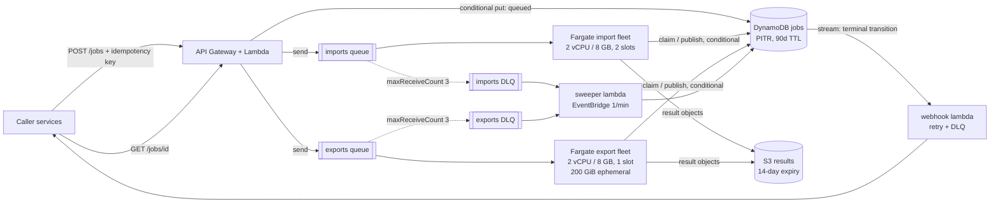

# Design review: legacy file conversion service

**Verdict: keep the proposal's shape, change three things about it.** API Gateway + Lambda, DynamoDB, SQS, and Fargate workers are the right components for 1,000 jobs/day of long, single-threaded, memory-hungry work. What is wrong is not the service list; it is that one queue, one fleet, one worker sizing, and one timeout are being asked to serve two workloads whose runtimes differ by two orders of magnitude, and that the worker treats at-least-once delivery as if it were exactly-once.

## 1. Risk ranking

**1. The worker can mark a healthy job failed, and can leave a job in `running` forever.** The 30-second deadline is shorter than a normal import and roughly 1/60th of a normal export, so essentially every real job trips it. On timeout the handler goes to `catch`, calls `message.retry()`, and returns — it never calls `conversion.kill()`. The observation "a timed-out subprocess may continue running unless its owner terminates and reaps it" is the other half of this: the orphan keeps its ~2 GB while the redelivery starts a second conversion beside it, which is a sufficient explanation on its own for the exit-137 kills the team is already seeing. Three deliveries later, `receiveCount >= 3` marks a perfectly valid job `failed`. *Customer impact:* imports and exports that would have succeeded come back as failures, with no distinction from a genuinely bad file; when the worker dies mid-message instead, the job sits in `running` with nobody working on it and no terminal state ever arrives, so a caller that is polling waits forever and a caller waiting on a webhook never gets one.

**2. Two workers can own the same job, and the loser's write wins.** Deliveries under 100 ms apart reach two workers; both read `queued`, both write `running`, both convert. Every `store.put` is an unconditional whole-object write built from a stale in-memory `job` snapshot, so the attempt that *finishes last* publishes last, and "a slow attempt may finish after another attempt has already published a result" turns into a job record that points at the older attempt's output. Both attempts also write the same `jobs/{jobId}/result.json`, so even a correct job record can point at bytes from the wrong attempt, possibly interleaved with a multipart upload still in flight. *Customer impact:* a package a customer downloads may be from an attempt that was superseded, or be a half-written object; a duplicated export is also 30 wasted minutes of a 2 GB slot at the exact moment the fleet is saturated.

**3. One queue, one fleet, and 10 concurrent messages on a 1 vCPU / 4 GB task.** Ten concurrent conversions at ~2 GB each is 20 GB of demand on a 4 GB task — the cgroup OOM killer produces exactly the exit 137 that "sometimes succeeds on a later run". Ten single-threaded conversions on 1 vCPU also means each runs at roughly a tenth speed, which is its own timeout amplifier. A shared queue puts 3,000 onboarding messages in one line, so a five-second import waits behind a queue of 40-minute exports (head-of-line blocking), and a poison export pattern pauses imports too. A 40 GB package also does not fit in Fargate's default 20 GiB of ephemeral storage. *Customer impact:* during onboarding, interactive imports that normally take seconds take hours; exports fail on disk-full or OOM and retry into the same wall.

### Two things I would deliberately leave alone

**DynamoDB plus API Gateway and Lambda as the control plane.** The access pattern is get-by-id, one conditional write per state transition, a GSI on idempotency key, and a 90-day TTL. That is what this database is for, and conditional writes are the primitive the fix in risk 2 depends on. *Revisit when:* callers need queries the key schema cannot serve (per-customer listing, reporting over completed jobs) and a second GSI stops being enough; or conditional-write rejections on a single job exceed ~1% sustained, which would mean contention rather than the rare duplicate we expect; or control-plane p99 is dominated by cold starts above roughly 5 sustained requests/second, at which point provisioned concurrency and then a container service become the cheaper answer.

**One worker codebase and one container image for both converters.** I am splitting the queues, the fleets, and the sizing, but not the code: the handler logic is identical and the duplication cost of two repos and two pipelines is real. The image carries a JVM the import path does not use. *Revisit when:* image size or JVM startup measurably hurts import latency (say, >10% of import p50 spent on task start), or the two paths' dependency and CVE-patching schedules start forcing redeploys of the other side. Both are visible in existing metrics — task start duration by fleet, and deploy frequency by reason — so this is a decision I can re-examine with data rather than opinion.

## 2. Smallest set of changes before v1

1. **Split the queue and the fleet.** `imports` and `exports` queues, each with its own DLQ (`maxReceiveCount` 3) and its own ECS service scaling independently. Same image, two task definitions.
2. **Size for the actual conversion.** Concurrency per task = `min(vCPU, floor((memGiB − 2) / 2))`. Import tasks: 2 vCPU / 8 GB, 2 slots. Export tasks: 2 vCPU / 8 GB, **1** slot, 200 GiB ephemeral storage.
3. **Per-kind deadlines that bound a hung process rather than enforce an SLO** — 15 minutes for imports, 120 minutes for exports — and on expiry, terminate *and reap* the subprocess before the message becomes visible again. (Implemented; see `src/handle.ts`.)
4. **Visibility timeout ≥ deadline + grace, refreshed by a heartbeat** (`ChangeMessageVisibility` every 60 s from the worker). Without this the queue itself manufactures the duplicate deliveries in risk 2.
5. **Single-writer discipline.** A `version` attribute on the job item; every transition is a conditional write; claiming sets a lease (`leaseExpiresAt = now + deadline + grace`). A delivery for a job with a live lease is returned to the queue instead of converting; a write that loses the condition is discarded rather than retried. (Implemented.)
6. **Per-attempt result keys** — `jobs/{id}/attempts/{n}/result.json` — so result objects are immutable and the conditional job-record write is the single atomic point at which a result becomes *the* result. (Implemented.)
7. **Permanent vs transient classification.** Exit 2 fails on the first attempt; 137, deadlines, and unknown errors retry against the stored `attempt`, not `receiveCount`. (Implemented.)
8. **A sweeper Lambda on a 1-minute schedule** that fails any job whose lease expired more than N minutes ago with no message in flight, and drains the DLQs into `failed`. This is what guarantees the "every job reaches a terminal state" property the API contract implies.
9. **Scale-in protection while a job is in flight.** Fargate's `stopTimeout` maxes out at 120 s, so a 40-minute export cannot be drained gracefully; the worker calls `UpdateTaskProtection` while converting and releases it between jobs. On `SIGTERM` it stops polling and returns any unstarted message with `ChangeMessageVisibility(0)`.
10. **An S3 lifecycle rule expiring results at 14 days**, and VPC gateway endpoints for S3 (see §5 — without them, NAT data processing is the largest line item on the bill).

Not in v1: splitting the repos, a step-function orchestrator, multi-region, or replacing SQS with anything.

## 3. Job lifecycle

**Import.** `POST /jobs {kind: import, inputKey, idempotencyKey}` → the API Lambda does a conditional put of `{status: queued, attempt: 0, version: 1}` keyed by job id, with the idempotency key on a GSI; a repeat key returns the existing job id and does not enqueue again. The API owns the `queued` state and nothing else. It sends one message `{jobId}` — no payload, so the job record stays the single source of truth — and returns `202` with the job id. A worker receives the message, reads the record, and claims it with a conditional write to `running` with `attempt = n + 1` and a lease; losing that condition means another worker owns the job, and the message goes back to the queue. The worker streams the input from S3, runs the TypeScript converter in-process against a 15-minute deadline, writes the JSON to `jobs/{id}/attempts/{n}/result.json`, and only then conditionally writes `succeeded` with that `outputKey`. **The S3 object is written first and the record second, so the record never advertises a result that does not exist**; a result object with no record pointing at it is garbage the lifecycle rule collects.

**Export.** Identical control flow, different economics: a 2 vCPU / 8 GB task with one slot and 200 GiB of scratch, a 120-minute deadline, the vendor JVM as a subprocess whose exit code the wrapper maps into the error the handler classifies, and a multipart upload of a 10–40 GB zip. Because the run is long, the heartbeat matters more: the visibility timeout is 125 minutes and is refreshed while the job runs, and the task is scale-in protected. If the task dies anyway, the message reappears, the lease has expired, and attempt `n+1` starts from scratch — exports are not resumable, which is a deliberate v1 choice (see NOTES).

**Retry boundaries.** There is exactly one: the queue. No in-process retry loop around a converter, because a retry that shares the failed process's memory and disk is the least likely to succeed and the most likely to OOM its neighbours. The stored `attempt` is the budget (3); `receiveCount` is observability plus a poison-pill backstop. A permanent failure short-circuits the budget. Redrive to DLQ is the third boundary and is terminal: the sweeper converts DLQ entries into `failed` records so the caller always learns.

**How the caller learns.** Polling `GET /jobs/{id}` reads the DynamoDB item directly; the four external states are exactly the item's `status`. For webhook subscribers, the terminal conditional write is the trigger: a DynamoDB stream filtered to transitions into `succeeded`/`failed` invokes a delivery Lambda that posts a signed payload with retries and its own DLQ. Deriving the webhook from the committed state change rather than from worker code removes the failure mode where a worker commits and then dies before notifying. Delivery is at-least-once and callers must dedupe on `(jobId, status)`.

## 4. Operations, deployment, observability

Everything above lives in one CDK app in this repo — two queues, two DLQs, the table, the buckets and lifecycle rules, both task definitions and services with their scaling policies, the sweeper and webhook Lambdas, the alarms, and the dashboard — so that an alarm threshold is reviewed in the same pull request as the code that trips it. Worker telemetry is CloudWatch EMF written to stdout (no metric API calls on the hot path), with `jobId`, `kind`, `attempt`, and the image tag on every structured log line; the metric names below are the event names emitted by `src/handle.ts`.

| Signal | Metric and where it comes from | Threshold | Action it causes |
|---|---|---|---|
| Backlog is not draining | `ApproximateAgeOfOldestMessage`, per queue, emitted by SQS to CloudWatch | imports > 10 min for 5 min; exports > 60 min for 10 min | Page. Check desired vs running tasks: if scaling is stuck, it is almost always the Fargate vCPU quota or subnet IP exhaustion, both of which are fixed by a limit increase, not by code. If tasks are running and age still climbs, look for one job cycling through retries. |
| Jobs failing for our reasons, not the customer's | `job.failed` count split by `classification` and `kind`, emitted by the handler's terminal write (EMF) | `classification=transient` > 5% of terminal jobs over 15 min | Page. Permanent failures (a customer's broken `.mdb`) are deliberately *not* on this alarm; they get a weekly report. Compare the failure rate by image tag against the last deploy and roll back if it correlates; otherwise sample the DLQ. |
| We are paying to do the same work twice | `job.deadline_exceeded`, `job.lease_held`, `job.claim_conflict`, `job.stale_write_discarded`, emitted by the handler | any `deadline_exceeded` above ~1/hour per kind, or conflicts above 10/hour | Ticket, not a page. These are the early warning for the risk-1 and risk-2 spirals: a deadline that no longer matches p99 runtime, or a heartbeat that has stopped extending visibility. Left alone they become OOM kills and duplicated exports. |

The fourth signal I would add as soon as those three are quiet is the sweeper's gauge of jobs whose lease expired with no message in flight, because it is the only direct detector of a caller waiting forever.

**How a change reaches production.** GitHub Actions on pull request runs typecheck, the vitest suite in this repo, and a `cdk diff` posted as a comment; on merge to `main` it builds one image tagged with the commit SHA, scans it, pushes to ECR, and deploys the CDK app to staging, where a canary job (one small import and one small export submitted every five minutes in every environment) must pass before promotion. Production is a rolling ECS deployment of the same image digest with the deployment circuit breaker enabled, one fleet at a time, imports first because their blast radius is minutes rather than tens of minutes. A bad release shows up as the canary going red, as `job.failed{classification=transient}` breaching, or as task start failures — all alarmed and all dimensioned by image tag, with deploy markers on the dashboard. Reversal is redeploying the previous task definition revision (the circuit breaker does this automatically for failed rollouts), and it is safe precisely because the queue holds the work: jobs interrupted by a rollback are redelivered, and the claim/lease logic makes redelivery idempotent rather than duplicative.

**Failure scenarios and recovery.** A worker crash or a spot-style reclaim loses at most one attempt, recovered by redelivery. A converter that hangs is bounded by the deadline and reaped. A DynamoDB conditional-write failure is treated as "someone else owns this" and never as a reason to convert again. If S3 or DynamoDB is impaired, workers fail transiently, the queue absorbs the backlog (14-day retention), and the fleet scales on age once service returns — the queue is the buffer that makes a dependency outage a latency event rather than a data-loss event. Disaster recovery is deliberately "rebuild and replay", not multi-region: the table has PITR (35 days, RPO ≈ 5 min), the CDK app rebuilds the stack in a second region in well under an hour, results are derived data that can be regenerated from customer-owned inputs, and the recovery procedure for in-flight work is to re-submit jobs whose records are non-terminal. Ownership: the platform team owns the queues, fleets, and pipeline and carries the pager for the three signals above; permanent conversion failures route to the team that owns the converter, not to the on-call engineer.

## 5. Sizing and cost

Assumptions, stated because they drive everything: import mean runtime 3 minutes, export mean runtime 30 minutes, mean package 20 GB, 30-day month, us-east-1 on-demand Fargate at $0.04048/vCPU-hour, $0.004445/GB-hour, $0.000111/GB-hour for ephemeral storage above the included 20 GiB. Import task (2 vCPU / 8 GB, 2 slots) = $0.117/hour, i.e. **$0.058 per import slot-hour**. Export task (2 vCPU / 8 GB, 1 slot, 200 GiB) = $0.117 + 180 × $0.000111 = **$0.137 per export slot-hour**.

**Onboarding evening — 3,000 jobs = 2,400 imports + 600 exports.** Import work: 2,400 × 3 min = 120 slot-hours. Export work: 600 × 30 min = 300 slot-hours. Drain targets of 1 hour for imports and 4 hours for exports give 120 import slots (**60 tasks**) and 75 export slots (**75 tasks**): 270 vCPU, ~1.1 TB of RAM, ~15 TB of ephemeral disk at peak. Two things break before the money does — the default Fargate on-demand vCPU quota is far below 270 and must be raised in advance, and ~135 tasks need ~135 ENIs, so the subnets need to be /22 rather than /24. The evening itself costs 60 × 1 × $0.117 + 75 × 4 × $0.137 ≈ **$48**. Scaling is target-tracking on backlog-per-task (`ApproximateNumberOfMessagesVisible / RunningCount`, target 2 for imports and 1 for exports), which with ~90-second task starts reaches full fleet in roughly 10 minutes.

**Normal monthly bill — 800 imports + 200 exports per day.** Compute: imports 800 × 3 min × 30 = 1,200 slot-hours × $0.058 ≈ $70; exports 200 × 30 min × 30 = 3,000 slot-hours × $0.137 ≈ $410; times ~1.4 for scale-from-zero lag and idle tail ≈ **$670**. Storage: exports create 200 × 20 GB × 30 = 120 TB/month, imports add ~5 TB. Held for the full 90 days that job metadata is retained, steady state is ~375 TB × $0.023/GB ≈ **$8,600/month**. DynamoDB (~180k writes and ~600k reads/month on-demand), SQS (~3M requests), API Gateway and Lambda together come to roughly **$10**; CloudWatch logs, custom metrics, and alarms about **$25**; VPC interface endpoints for ECR, logs, and STS about **$60**. Total ≈ **$9,400/month**, of which 91% is S3.

The biggest line item is S3 storage of export packages, and **the single change that cuts it most is a 14-day lifecycle expiry on `jobs/*/attempts/*`** — packages are derived data, re-creatable from inputs the customer already owns, and the 90-day retention requirement is on job *metadata*, not on 40 GB zips. That takes storage from ~375 TB to ~58 TB, about **$1,300/month**, and the total bill to roughly **$2,100** — a 78% cut for one lifecycle rule. Two caveats worth more than they cost: a **gateway VPC endpoint for S3 is mandatory**, because routing 120 TB/month through a NAT gateway at $0.045/GB would add ~$5,400/month and quietly become the largest line on the bill; and this estimate assumes consumers read packages in-region, so internet egress is zero — if even 10% of packages are downloaded over the internet, that is ~12 TB at $0.05–0.09/GB, or $600–1,100/month, which would change where I spend the next optimization.
