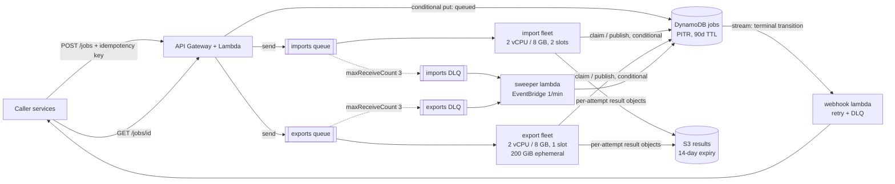

# Design review: legacy file conversion service

**Verdict: keep the proposal's shape, change three things about it.** These services suit 1,000 jobs/day of long, single-threaded, memory-hungry work. The problem is that one queue, one fleet, one task size, and one timeout serve two workloads whose runtimes differ by two orders of magnitude, and that the worker treats at-least-once delivery as exactly-once.

## 1. Risk ranking

**1. The worker fails healthy jobs, and strands others in `running`.** A 30-second deadline times out every real job, and the timeout path calls `retry()` without `kill()`, so the orphan holds its ~2 GB while the redelivery converts beside it: the exit-137 spiral. Three deliveries later, `receiveCount >= 3` fails it. *Customer impact:* good work returns as a failure indistinguishable from a bad file, and a worker that dies mid-message leaves the caller polling forever.

**2. Two workers can own one job, and the slower one's write wins.** Deliveries 100 ms apart both read `queued` and both convert; every `put` is an unconditional write over a stale snapshot, so whichever attempt finishes *last* publishes last, and both write the same `result.json`. *Customer impact:* the customer downloads a superseded or half-written package, and the duplicate export wastes 30 minutes of a contended slot.

**3. One queue, one fleet, ten concurrent messages on a 1 vCPU / 4 GB task.** Ten ~2 GB conversions against 4 GB is fivefold oversubscription — the OOM killer behind exit 137 — and ten single-threaded jobs on one core each run at a tenth speed, feeding risk 1. One queue also puts a five-second import behind 40-minute exports, and 40 GB does not fit the default 20 GiB disk. *Customer impact:* during onboarding, imports that take seconds take hours, and exports die on disk-full or OOM.

**Deliberately left alone — DynamoDB, API Gateway, and Lambda as the control plane.** Get-by-id, one conditional write per transition, a GSI on idempotency key, a 90-day TTL — and that write is the primitive risk 2 needs. *Revisit when* a second GSI stops serving caller queries, write rejections pass ~1% sustained, or cold starts dominate p99.

**Deliberately left alone — one worker codebase and image for both converters.** I split the queues, fleets, and sizing, not the code; the price is an image carrying a JVM imports never use. *Revisit when* task start exceeds ~10% of import p50, or either path's CVE schedule forces redeploys of the other.

## 2. Smallest set of changes before v1

1. **Split the queue and the fleet:** `imports` and `exports`, each with its own DLQ (`maxReceiveCount` 3) and scaling policy.
2. **Size for the conversion:** slots = `min(vCPU, floor((memGiB − 2) / 2), floor(diskGiB / scratchGiB))` — imports 2 vCPU / 8 GB and 2 slots, exports the same plus 200 GiB and 1 slot.
3. **Per-kind deadlines** (15 and 120 minutes) that terminate *and reap* on expiry. *(Implemented.)*
4. **Visibility timeout ≥ deadline + grace, heartbeated every 60 s**, or the queue itself creates risk 2.
5. **Single-writer discipline:** a `version` attribute, a conditional write per transition, `leaseExpiresAt` on claim; a live lease defers the delivery. *(Implemented.)*
6. **Per-attempt result keys**, making the record write the one atomic publish point. *(Implemented.)*
7. **Permanent vs transient classification:** exit 2 fails immediately; 137 and deadlines retry against the stored `attempt`, never `receiveCount`. *(Implemented.)*
8. **A sweeper Lambda every minute**, failing expired leases with no message in flight and draining DLQs into `failed` — what guarantees a terminal state.
9. **Scale-in protection while converting**, since `stopTimeout` caps at 120 s and a 40-minute export cannot drain gracefully.
10. **A 14-day S3 lifecycle expiry on results, and a gateway VPC endpoint for S3**, without which NAT is the largest line on the bill.

Not in v1: splitting repos, an orchestrator, multi-region, or replacing SQS.

## 3. Job lifecycle

**Import.** `POST /jobs` → the API Lambda conditionally puts `{queued, attempt: 0, version: 1}` with the idempotency key on a GSI, so a repeat returns the existing job. The API owns `queued`; the message carries only `{jobId}`. A worker claims the job with a conditional write to `running`, `attempt = n+1`, and a lease; the loser returns its message. It converts under a 15-minute deadline, writes `jobs/{id}/attempts/{n}/result.json`, then conditionally writes `succeeded` pointing at it — **object first, record second**, so the record never advertises a result that does not exist.

**Export.** Same flow, different economics: one slot with 200 GiB of scratch, a 120-minute deadline, the vendor JVM as a subprocess whose exit code the wrapper surfaces, and a multipart upload of 10–40 GB. Visibility timeout is 125 minutes, heartbeated, and the task is scale-in protected; if it dies, the lease expires and attempt `n+1` restarts, since exports are not resumable in v1.

**Retry boundaries.** Exactly one: the queue. A retry sharing the failed process's memory and disk is least likely to succeed and most likely to OOM its neighbours. Stored `attempt` is the budget (3), `receiveCount` is only a poison-pill backstop, permanent failures short-circuit it, and DLQ redrive is terminal.

**How the caller learns.** `GET /jobs/{id}` reads the item — the four external states are its `status`. Webhook subscribers are served from a DynamoDB stream filtered to terminal transitions, which invokes a delivery Lambda that posts a signed payload with backoff and its own DLQ. Triggering from the committed state change, not from worker code, removes the failure mode where a worker commits and dies before notifying. Delivery is at-least-once, so callers dedupe on `(jobId, status)`.

## 4. Operations, deployment, observability

Everything above lives in one CDK app in this repo — every queue, table, bucket, task definition, Lambda, and alarm — so a threshold is reviewed in the same pull request as the code that trips it. Worker telemetry is CloudWatch EMF on stdout carrying `jobId`, `kind`, `attempt`, and image tag; the metric names below are the events `src/handle.ts` emits.

| Signal | Metric and emission point | Threshold | Action |
|---|---|---|---|
| Backlog is not draining | `ApproximateAgeOfOldestMessage`, per queue, from SQS | imports > 10 min for 5 min; exports > 60 min for 10 min | Page. Compare desired vs running tasks: stuck scaling is almost always the Fargate vCPU quota or subnet IP exhaustion, fixed by a limit increase, not code. If tasks are running and age still climbs, look for one job cycling through retries. |
| Failures that are ours, not the customer's | `job.failed` by `classification` and `kind`, EMF from the handler's terminal write | `classification=transient` > 5% of terminal jobs over 15 min | Page. Permanent failures (a customer's broken `.mdb`) are deliberately excluded and get a weekly report instead. Check the rate by image tag against the last deploy, roll back if correlated, otherwise sample the DLQ. |
| Paying to do the same work twice | `job.deadline_exceeded`, `job.lease_held`, `job.claim_conflict`, `job.stale_write_discarded`, EMF from the handler | any `deadline_exceeded` above ~1/hour per kind, or conflicts above 10/hour | Ticket, not a page. These are the early warning for the risk-1 and risk-2 spirals: a deadline that no longer matches p99 runtime, or a heartbeat that has stopped extending visibility. Ignored, they become OOM kills and duplicate exports. |

**How a change reaches production.** GitHub Actions on pull request runs typecheck, the vitest suite in this repo, and a `cdk diff` posted as a comment; on merge it builds one image tagged with the commit SHA, scans it, pushes to ECR, and deploys to staging, where a canary job — one small import and one small export submitted every five minutes in every environment — must pass before promotion. Production is a rolling ECS deployment of the same image digest with the deployment circuit breaker on, one fleet at a time, imports first because their blast radius is minutes rather than tens of minutes. A bad release shows up as the canary going red, `job.failed{classification=transient}` breaching, or task starts failing — all alarmed, all dimensioned by image tag, with deploy markers on the dashboard. Reversal is redeploying the previous task definition revision, which the circuit breaker does automatically for a failed rollout, and it is safe precisely because the queue holds the work: interrupted jobs are redelivered, and the claim/lease logic makes redelivery idempotent rather than duplicative.

**Failure, recovery, ownership.** A worker crash costs one attempt, a hung converter is bounded by the deadline and reaped, and a lost conditional write means "someone else owns this", never "convert again". A dependency outage is a latency event, not a data-loss event, because the queue absorbs 14 days of backlog; DR is rebuild-and-replay, with PITR giving RPO ≈ 5 minutes and results being derived data. The platform team owns the queues, fleets, and pipeline and pages on these three signals; permanent conversion failures route to the converter's owning team.

## 5. Sizing and cost

At us-east-1 on-demand rates an import slot costs **$0.058/hour** and an export slot, with its 200 GiB attached, **$0.137/hour**. Assume import mean 3 minutes, export mean 30 minutes, 20 GB packages.

**Onboarding evening — 2,400 imports + 600 exports.** Import work is 2,400 × 3 min = 120 slot-hours; export work 600 × 30 min = 300 slot-hours. Draining imports in 1 hour and exports in 4 needs 120 import slots (**60 tasks**) and 75 export slots (**75 tasks**): 270 vCPU and ~15 TB of scratch at peak, for ≈ **$48**. Money is not the constraint — the Fargate vCPU quota defaults far below 270, and 135 ENIs need /22 subnets.

**Normal month — 800 imports + 200 exports a day.** Compute is 1,200 import slot-hours ($70) plus 3,000 export slot-hours ($410), ×1.4 for scale-from-zero lag ≈ **$670**. Exports create 120 TB/month; over the 90-day retention window that is ~375 TB × $0.023/GB ≈ **$8,600**. Everything else is under **$100**. Total ≈ **$9,400/month, 91% of it S3.**

So the biggest line item is S3 storage of export packages, and **the change that cuts it most is a 14-day lifecycle expiry on results**: packages are derived data, re-creatable from inputs the customer owns, and the 90-day requirement is on job *metadata*, not 40 GB zips. Storage drops to ~58 TB and the bill to ~**$2,100**, a 78% cut from one rule. One caveat dwarfs the rest: a gateway VPC endpoint for S3 is mandatory, since 120 TB/month through NAT adds ~$5,400.

---

*[APPENDIX.md](./APPENDIX.md): cost table and rates, slot-formula derivation, quota and ENI planning, the failure and DR walkthrough, and the fourth signal.*
