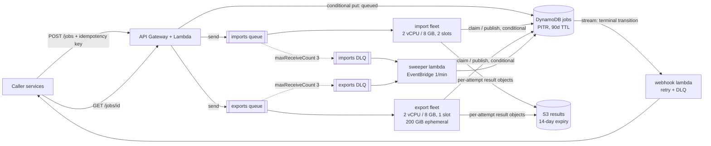

# Design review: legacy file conversion service

**Verdict: keep the proposal's shape, change three things about it.** API Gateway + Lambda, DynamoDB, SQS, and Fargate are the right components for 1,000 jobs/day of long, single-threaded, memory-hungry work. The problem is not the service list. It is that one queue, one fleet, one task size, and one timeout are serving two workloads whose runtimes differ by two orders of magnitude, and that the worker treats at-least-once delivery as if it were exactly-once.

## 1. Risk ranking

**1. The worker fails healthy jobs, and strands others in `running` forever.** The 30-second deadline is shorter than a normal import and about 1/60th of a normal export, so essentially every real job trips it. On timeout the handler goes to `catch`, calls `message.retry()`, and returns — it never calls `conversion.kill()`. That is the other half of "a timed-out subprocess may continue running unless its owner terminates and reaps it": the orphan keeps its ~2 GB while the redelivery starts a second conversion beside it, which on its own explains the exit-137 kills the team is seeing. Three deliveries later, `receiveCount >= 3` marks a valid job `failed`. *Customer impact:* work that would have succeeded comes back as a failure indistinguishable from a genuinely bad file; and when a worker dies mid-message instead, nothing ever writes a terminal state, so a polling caller waits forever and a webhook never fires.

**2. Two workers can own one job, and the slower one's write wins.** Deliveries under 100 ms apart reach two workers; both read `queued`, both write `running`, both convert. Every `put` is an unconditional whole-object write built from a stale in-memory snapshot, so the attempt that *finishes last* publishes last — which is exactly "a slow attempt may finish after another attempt has already published a result". Both attempts also write the same `jobs/{jobId}/result.json`, so even a correct job record can point at the wrong attempt's bytes, or at an object still being overwritten. *Customer impact:* a customer downloads a superseded or half-written package, and a duplicated export burns 30 minutes of a 2 GB slot at the moment the fleet is most contended.

**3. One queue, one fleet, and 10 concurrent messages on a 1 vCPU / 4 GB task.** Ten conversions at ~2 GB is 20 GB of demand on a 4 GB task; the cgroup OOM killer produces precisely the exit 137 that "succeeds on a later run". Ten single-threaded conversions on one core also each run at a tenth speed, which amplifies the timeout in risk 1. A shared queue puts 3,000 onboarding messages in one line, so a five-second import waits behind 40-minute exports, and a bad export pattern stalls imports too. A 40 GB package also does not fit in Fargate's default 20 GiB of ephemeral storage. *Customer impact:* during onboarding, imports that take seconds take hours; exports die on disk-full or OOM and retry into the same wall.

### Two things I would deliberately leave alone

**DynamoDB with API Gateway and Lambda as the control plane.** The access pattern is get-by-id, one conditional write per transition, a GSI on idempotency key, and a 90-day TTL. That is what this database is for, and the conditional write is the primitive the risk-2 fix depends on. *Revisit when:* callers need queries the key schema cannot serve (per-customer listing, reporting) and a second GSI is not enough; or conditional-write rejections exceed ~1% sustained, meaning real contention rather than the rare duplicate; or cold starts dominate control-plane p99 above ~5 sustained req/s, where provisioned concurrency and then a container service get cheaper.

**One worker codebase and one image for both converters.** I am splitting the queues, the fleets, and the sizing — not the code. The handler logic is identical and two repos and two pipelines are a real cost; the price is an image carrying a JVM the import path never uses. *Revisit when:* task start time is more than ~10% of import p50, or the two paths' dependency and CVE schedules start forcing redeploys of the other side. Both are already visible in task-start duration by fleet and deploy frequency by reason, so this gets re-decided with data.

## 2. Smallest set of changes before v1

1. **Split the queue and the fleet.** `imports` and `exports` queues, each with its own DLQ (`maxReceiveCount` 3) and its own service scaling independently. Same image, two task definitions.
2. **Size for the actual conversion.** Slots per task = `min(vCPU, floor((memGiB − 2) / 2), floor(diskGiB / peakScratchGiB))`. Imports: 2 vCPU / 8 GB, 2 slots. Exports: 2 vCPU / 8 GB, 200 GiB ephemeral, **1** slot — the disk term binds, since a 40 GB package needs ~100 GiB of scratch while it is staged and zipped.
3. **Per-kind deadlines that bound a hang rather than enforce an SLO** — 15 min imports, 120 min exports — and on expiry, terminate *and reap* before the message becomes visible again. *(Implemented.)*
4. **Visibility timeout ≥ deadline + grace, refreshed by a `ChangeMessageVisibility` heartbeat every 60 s.** Without this the queue itself manufactures the duplicates in risk 2.
5. **Single-writer discipline.** A `version` attribute; every transition is a conditional write; claiming sets `leaseExpiresAt`. A delivery for a job with a live lease goes back to the queue instead of converting, and a write that loses its condition is discarded, not retried. *(Implemented.)*
6. **Per-attempt result keys**, `jobs/{id}/attempts/{n}/result.json`, so result objects are immutable and the conditional record write is the one atomic point where a result becomes *the* result. *(Implemented.)*
7. **Permanent vs transient classification.** Exit 2 fails on the first attempt; 137, deadlines, and unknown errors retry against the stored `attempt`, never `receiveCount`. *(Implemented.)*
8. **A sweeper Lambda, every minute**, failing jobs whose lease expired with no message in flight and draining DLQs into `failed`. This is what makes "every job reaches a terminal state" true.
9. **Scale-in protection while converting.** Fargate `stopTimeout` caps at 120 s, so a 40-minute export cannot drain gracefully; the worker holds `UpdateTaskProtection` while a job runs and releases it between jobs, and on `SIGTERM` stops polling and returns unstarted messages with `ChangeMessageVisibility(0)`.
10. **A 14-day S3 lifecycle expiry on results, and a gateway VPC endpoint for S3** (see §5 — without the endpoint, NAT data processing is the largest line on the bill).

Not in v1: splitting repos, an orchestrator, multi-region, or replacing SQS.

## 3. Job lifecycle

**Import.** `POST /jobs {kind, inputKey, idempotencyKey}` → the API Lambda conditionally puts `{status: queued, attempt: 0, version: 1}`, with the idempotency key on a GSI so a repeat returns the existing job id and enqueues nothing. The API owns `queued` and nothing else. It sends a message containing only `{jobId}` — the record stays the single source of truth — and returns `202`. A worker reads the record and *claims* it with a conditional write to `running`, `attempt = n+1`, and a lease; losing that condition means someone else owns the job, and the message goes back. The worker streams the input from S3, runs the TypeScript converter in-process under a 15-minute deadline, writes JSON to `jobs/{id}/attempts/{n}/result.json`, and only then conditionally writes `succeeded` with that `outputKey`. **Object first, record second**, so the record never advertises a result that does not exist; an orphaned object is garbage the lifecycle rule collects.

**Export.** Same control flow, different economics: one slot on a 2 vCPU / 8 GB task with 200 GiB of scratch, a 120-minute deadline, the vendor JVM as a subprocess whose exit code the wrapper maps into the error the handler classifies, and a multipart upload of a 10–40 GB zip. The long runtime is why the heartbeat matters: visibility timeout is 125 minutes and refreshed while the job runs, and the task is scale-in protected. If it dies anyway, the message reappears, the lease has expired, and attempt `n+1` starts from scratch — exports are not resumable, a deliberate v1 choice (see NOTES).

**Retry boundaries.** Exactly one: the queue. No in-process retry around a converter, because a retry sharing the failed process's memory and disk is the least likely to succeed and the most likely to OOM its neighbours. The stored `attempt` is the budget (3); `receiveCount` is observability and a poison-pill backstop. Permanent failures short-circuit the budget. Redrive to DLQ is terminal, and the sweeper turns DLQ entries into `failed` records so the caller always learns.

**How the caller learns.** `GET /jobs/{id}` reads the item directly; the four external states are its `status`. For webhook subscribers the terminal conditional write is the trigger: a DynamoDB stream filtered to transitions into `succeeded`/`failed` invokes a delivery Lambda that posts a signed payload with backoff and its own DLQ. Deriving the webhook from the committed state change instead of from worker code removes the failure mode where a worker commits and then dies before notifying. Delivery is at-least-once; callers dedupe on `(jobId, status)`.

## 4. Operations, deployment, observability

All of the above lives in one CDK app in this repo — queues, DLQs, table, buckets and lifecycle rules, both task definitions and their scaling policies, the sweeper and webhook Lambdas, the alarms, and the dashboard — so an alarm threshold is reviewed in the same pull request as the code that trips it. Worker telemetry is CloudWatch EMF on stdout (no metric API calls on the hot path) with `jobId`, `kind`, `attempt`, and image tag on every line; the metric names below are the event names `src/handle.ts` emits.

| Signal | Metric and emission point | Threshold | Action |
|---|---|---|---|
| Backlog is not draining | `ApproximateAgeOfOldestMessage`, per queue, from SQS | imports > 10 min for 5 min; exports > 60 min for 10 min | Page. Compare desired vs running tasks: stuck scaling is almost always the Fargate vCPU quota or subnet IP exhaustion, fixed by a limit increase, not code. If tasks are running and age still climbs, look for one job cycling through retries. |
| Failures that are ours, not the customer's | `job.failed` by `classification` and `kind`, EMF from the handler's terminal write | `classification=transient` > 5% of terminal jobs over 15 min | Page. Permanent failures (a customer's broken `.mdb`) are deliberately excluded and get a weekly report instead. Check the rate by image tag against the last deploy, roll back if correlated, otherwise sample the DLQ. |
| Paying to do the same work twice | `job.deadline_exceeded`, `job.lease_held`, `job.claim_conflict`, `job.stale_write_discarded`, EMF from the handler | any `deadline_exceeded` above ~1/hour per kind, or conflicts above 10/hour | Ticket, not a page. These are the early warning for the risk-1 and risk-2 spirals: a deadline that no longer matches p99 runtime, or a heartbeat that has stopped extending visibility. Ignored, they become OOM kills and duplicate exports. |

The fourth signal I would add once those are quiet is the sweeper's count of jobs whose lease expired with no message in flight — the only direct detector of a caller waiting forever.

**How a change reaches production.** GitHub Actions on pull request runs typecheck, the vitest suite in this repo, and a `cdk diff` posted as a comment; on merge it builds one image tagged with the commit SHA, scans it, pushes to ECR, and deploys to staging, where a canary job — one small import and one small export submitted every five minutes in every environment — must pass before promotion. Production is a rolling ECS deployment of the same image digest with the deployment circuit breaker on, one fleet at a time, imports first because their blast radius is minutes rather than tens of minutes. A bad release shows as the canary going red, `job.failed{classification=transient}` breaching, or task start failures — all alarmed, all dimensioned by image tag, with deploy markers on the dashboard. Reversal is redeploying the previous task definition revision (the circuit breaker does it automatically for failed rollouts), and it is safe precisely because the queue holds the work: interrupted jobs are redelivered, and the claim/lease logic makes redelivery idempotent instead of duplicative.

**Failure, recovery, ownership.** A worker crash or reclaim loses at most one attempt and is recovered by redelivery. A hung converter is bounded by the deadline and reaped. A lost conditional write means "someone else owns this" and never "convert again". If S3 or DynamoDB is impaired, workers fail transiently, the queue absorbs the backlog for up to 14 days, and the fleet scales on message age once service returns — the queue is what makes a dependency outage a latency event rather than a data-loss event. DR is deliberately rebuild-and-replay, not multi-region: PITR on the table gives RPO ≈ 5 minutes, the CDK app rebuilds the stack elsewhere in well under an hour, results are derived data regenerable from customer-owned inputs, and recovery for in-flight work is re-submitting jobs whose records are non-terminal. The platform team owns the queues, fleets, and pipeline and carries the pager for the three signals; permanent conversion failures route to the converter's owning team, not to on-call.

## 5. Sizing and cost

Assumptions that drive everything: import mean 3 min, export mean 30 min, mean package 20 GB, 30-day month, us-east-1 on-demand at $0.04048/vCPU-hour, $0.004445/GB-hour, $0.000111/GB-hour for ephemeral storage above the included 20 GiB. Import task (2 vCPU / 8 GB, 2 slots) = $0.117/hour → **$0.058 per import slot-hour**. Export task (2 vCPU / 8 GB, 1 slot, 200 GiB) = $0.117 + 180 × $0.000111 = **$0.137 per export slot-hour**.

**Onboarding evening — 3,000 jobs = 2,400 imports + 600 exports.** Import work: 2,400 × 3 min = 120 slot-hours. Export work: 600 × 30 min = 300 slot-hours. Draining imports in 1 hour and exports in 4 gives 120 import slots (**60 tasks**) and 75 export slots (**75 tasks**): 270 vCPU, ~1.1 TB RAM, ~15 TB of ephemeral disk at peak. Two things break before the money does — the default Fargate on-demand vCPU quota is far below 270 and must be raised in advance, and ~135 tasks need ~135 ENIs, so subnets want to be /22, not /24. The evening itself costs 60 × 1 × $0.117 + 75 × 4 × $0.137 ≈ **$48**. Scaling is target-tracking on backlog per task (`ApproximateNumberOfMessagesVisible / RunningCount`, target 2 for imports, 1 for exports); with ~90-second task starts the fleet is full in roughly ten minutes.

**Normal monthly bill — 800 imports + 200 exports per day.** Compute: imports 800 × 3 min × 30 = 1,200 slot-hours × $0.058 ≈ $70; exports 200 × 30 min × 30 = 3,000 slot-hours × $0.137 ≈ $410; × ~1.4 for scale-from-zero lag and the idle tail ≈ **$670**. Storage: exports create 200 × 20 GB × 30 = 120 TB/month and imports ~5 TB; held for the full 90 days that job metadata is retained, steady state is ~375 TB × $0.023/GB ≈ **$8,600**. DynamoDB (~180k writes, ~600k reads on-demand), SQS (~3M requests), API Gateway and Lambda together ≈ **$10**; CloudWatch logs, metrics, alarms ≈ **$25**; interface endpoints for ECR, logs, STS ≈ **$60**. Total ≈ **$9,400/month, 91% of it S3**.

The biggest line item is S3 storage of export packages, and **the single change that cuts it most is a 14-day lifecycle expiry on `jobs/*/attempts/*`**: packages are derived data, re-creatable from inputs the customer already owns, and the 90-day requirement is on job *metadata*, not on 40 GB zips. Storage drops from ~375 TB to ~58 TB (~$1,300), and the bill to roughly **$2,100** — a 78% cut from one rule. Two caveats worth more than they cost: a **gateway VPC endpoint for S3 is mandatory**, since routing 120 TB/month through NAT at $0.045/GB adds ~$5,400/month and silently becomes the largest line; and this assumes consumers read in-region, so internet egress is zero — if even 10% of packages leave over the internet, that is ~12 TB at $0.05–0.09/GB, or $600–1,100/month, which would move where I spend the next optimization.
