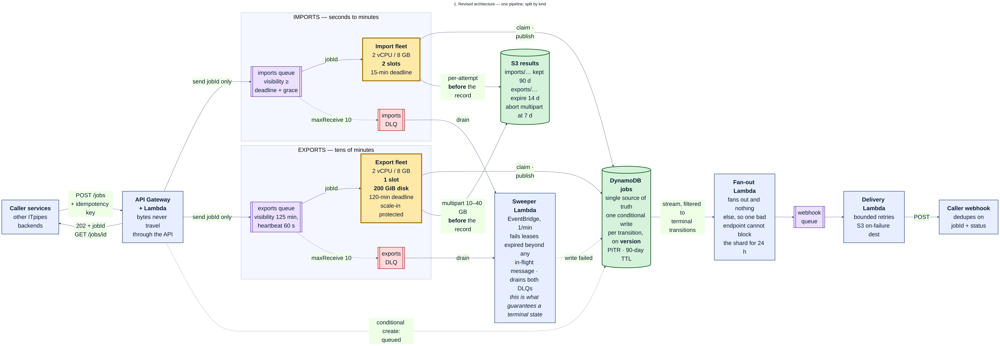
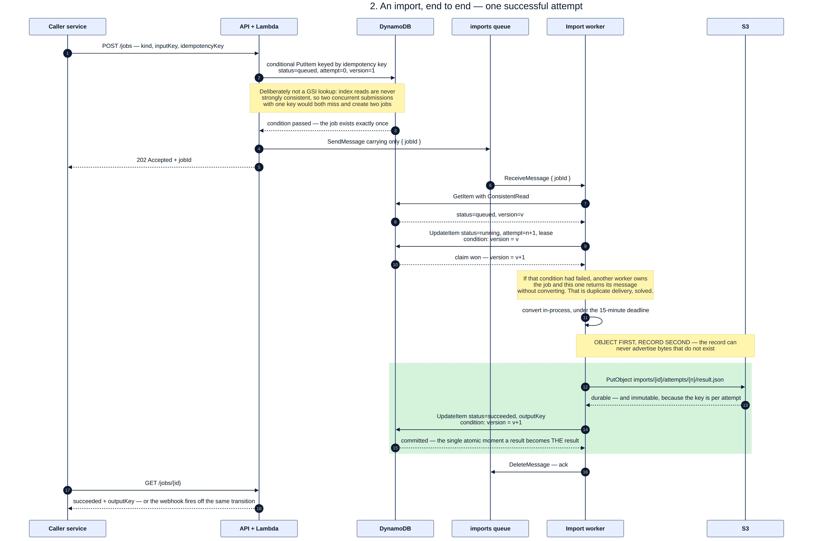
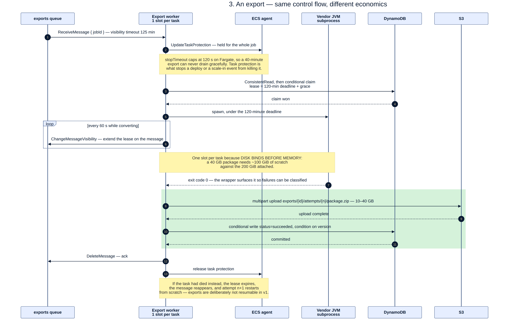
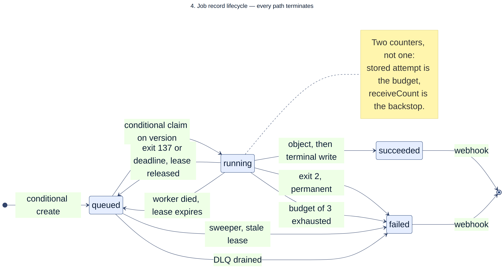
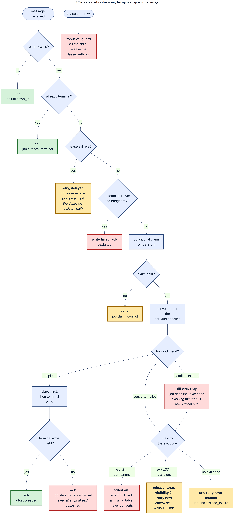
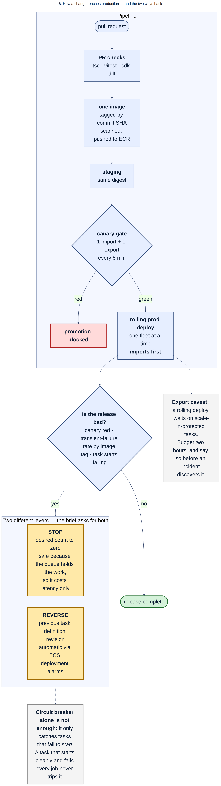
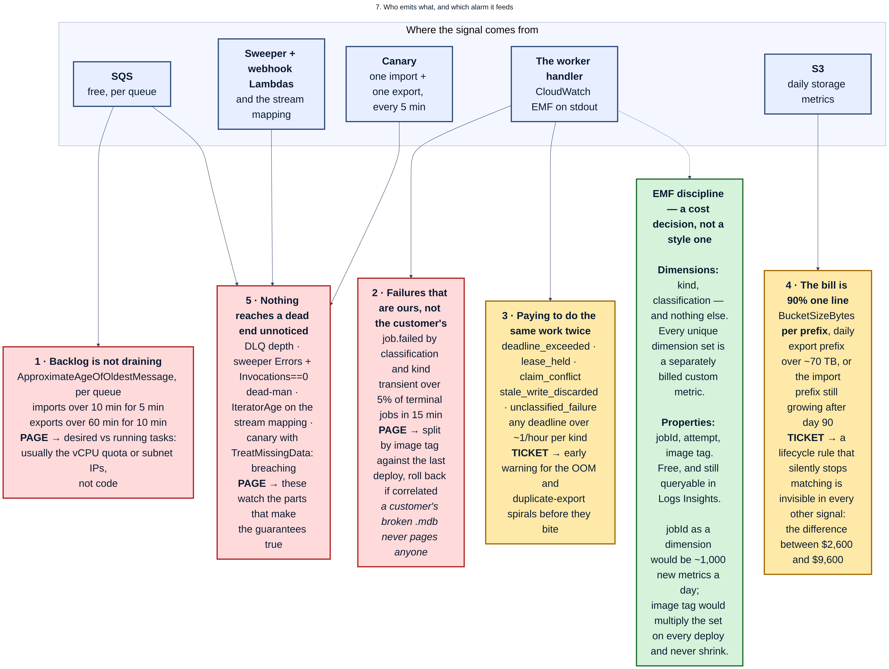

# ITpipes onsite prep

Study material for the 60-minute design and code review. This is **not** part of the take-home submission — keep it off anything you send to the panel.

- Walkthrough, numbers, challenge questions, and soft spots: [onsite-prep.md](./onsite-prep.md)
- Diagram sources (Mermaid): [diagrams/src/](./diagrams/src/)

## Diagrams

### 1. Architecture

### 2. Import, end to end

### 3. Export — same control flow, different economics

### 4. Job lifecycle

### 5. Handler branches

### 6. Delivery pipeline

### 7. Observability map

